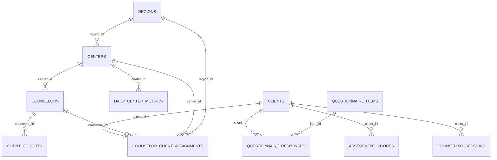

# 가족센터 AI 상담 통합 플랫폼 기술명세서

## 1. 문서 개요

### 1.1 목적

이 문서는 가족센터 AI 상담 통합 플랫폼의 현재 구현 구조와 확장 기준을 정의한다. 프런트엔드와 백엔드의 연결, 상담·운영 데이터의 관계, 상담 코파일럿과 교육 기능의 처리 흐름, 수요예측·예약 대기압력 계산, AI·OCR·음성·영상 서비스 연결 계약, 기관 클라우드 전환 절차를 하나의 기준 문서로 정리한다.

이 문서는 기능을 실제보다 넓게 주장하지 않는다. 현재 코드로 바로 확인할 수 있는 범위와 외부 GPU 서비스 또는 운영 인프라를 추가해야 활성화되는 범위를 분리해 기술한다.

### 1.2 기준 시점과 적용 범위

- 기준일은 2026년 8월 24일이다.
- 기준 소스는 본 패키지의 `backend/`, `frontend/`, `colab/`, `workers/`, `contracts/`, `deploy/` 및 `docs/`이다.
- 기준 데이터는 별도 데이터 패키지의 `family_center_data/실제사용_데이터셋/`과 `family_center_data/확인용_데이터셋/`이다.
- 본 문서에서 소스 파일 경로는 `DX_05조_소스코드.zip`의 루트를 기준으로 표시한다.
- 현재 배포본은 합성 데이터와 데모 인증을 사용하는 교육·연구용 프로토타입이다.
- 실제 내담자 적용, 진단, 자동 위험등급 결정, 상담사 자격평가 또는 무인 의사결정을 목적으로 하지 않는다.

### 1.3 구현 상태 구분

| 구분 | 의미 | 현재 예시 |
|---|---|---|
| 기본 구현 | 별도 GPU 서비스 없이 로컬에서 실행할 수 있다. | Next.js 화면, FastAPI API, SQLite 사례조회, 관리자 대시보드, 규칙 기반 점수, `mock` 코파일럿, 정적 2D 교육 흐름 |
| 연결 구현 | HTTP 어댑터와 서버 실행 코드는 있으나 URL·키·GPU 서비스를 연결해야 한다. | Mi:dm, PaddleOCR-VL, Qwen TTS, Qwen ASR, LongCat |
| 운영 전환 항목 | 현재 파일 기반 구조를 다중 사용자·다중 인스턴스 운영 구조로 교체해야 한다. | SSO/OIDC, PostgreSQL, Redis, 객체 저장소, 비밀관리, 감사로그, 모니터링 |

## 2. 시스템 개요

### 2.1 서비스 목적

플랫폼은 가족센터 업무를 다음 네 영역으로 연결한다.

1. 관리자에게 지역·센터·상담인력·상담수요의 집계와 28일 전망을 제공한다.
2. 상담사에게 담당 사례, 사전문진, 이전 확정 회기 및 면담 준비용 코파일럿 관점을 제공한다.
3. OCR 결과의 사람 검수 후 상담기록·보고서 초안을 생성하는 흐름을 제공한다.
4. 가상 내담자와의 대화 연습 및 자체 발화 규칙 기반 피드백을 제공한다.

### 2.2 논리 아키텍처

```text
[사용자 브라우저]
  └─ Next.js 16 / React 19 / TypeScript
       ├─ 관리자 화면
       ├─ 상담사 사례·코파일럿 화면
       ├─ 문서·OCR·보고서 화면
       └─ 상담사 교육 화면
                │ HTTPS/JSON, Bearer token, 일부 SSE
                ▼
[FastAPI API 게이트웨이]
  ├─ 인증·역할·담당사례 접근통제
  ├─ 상담사례 Repository ───── SQLite 읽기 전용
  ├─ 운영 대시보드 Service ── CSV/JSON 데이터마트
  ├─ 회기·교육 상태 Store ─── JSON/메모리(현재 프로토타입)
  ├─ 코파일럿·기록 Service ── mock 또는 Mi:dm HTTP
  ├─ OCR Service ───────────── PaddleOCR-VL HTTP
  ├─ Speech Service ────────── Qwen TTS/ASR HTTP
  └─ Avatar Service ────────── static_2d 또는 LongCat HTTP
```

브라우저는 모델 서버에 직접 접근하지 않는다. 인증, 입력 정규화, 사례 접근통제, 프롬프트 구성, 응답 형식 검증과 폴백은 FastAPI에서 처리한다. 운영 전환 시에도 이 게이트웨이 경계를 유지하고, GPU 서비스는 내부망의 독립 서비스로 분리하는 구성을 권장한다.

### 2.3 실행 프로필

#### 기본 로컬 프로필

- `AI_PROVIDER=mock`을 사용한다.
- `AVATAR_PROVIDER=static_2d`를 사용한다.
- 상담 데이터는 별도 SQLite를 읽기 전용으로 연결한다.
- 운영 데이터는 소스에 포함된 `backend/data/dashboard_demo/`를 읽는다.
- 프런트 마이크 입력은 지원 브라우저의 Web Speech API를 사용한다.
- `.env.example`의 백엔드 `STT_PROVIDER`는 `qwen_http`이므로 Qwen URL을 설정하지 않으면 `/api/v1/speech/status`는 미연결로 표시된다. 이는 현재 프런트의 Web Speech 입력과 별도 상태다.
- 외부 GPU와 모델 가중치가 없어도 화면·API·데이터 연결·결정론적 흐름을 확인할 수 있다.

#### GPU 연결 프로필

- Mi:dm·PaddleOCR-VL·Qwen TTS/ASR·LongCat 서버를 Colab 또는 기관 GPU에 실행한다.
- `.env`에 제공자, 내부 URL, 모델명과 키를 설정한 뒤 FastAPI를 재시작한다.
- 프로덕션 프런트 API 주소를 변경하면 `NEXT_PUBLIC_API_BASE_URL`이 빌드 시 반영되므로 프런트엔드를 다시 빌드한다.
- 각 기능은 독립적으로 연결할 수 있으며 한 기능의 장애가 전체 화면을 중단시키지 않도록 폴백을 둔다.

## 3. 기술 스택

### 3.1 애플리케이션

| 계층 | 기술 | 버전·구성 | 역할 |
|---|---|---|---|
| 프런트엔드 | Next.js | 16.2.12, App Router, standalone build | 라우팅, 서버·클라이언트 렌더링, 배포 산출물 생성 |
| UI | React / React DOM | 19.2.8 | 관리자·상담사·교육 화면 구성 |
| 언어 | TypeScript | 6.0.2 | API 타입과 UI 로직 정적 검사 |
| 백엔드 | FastAPI | `>=0.115,<1` | REST API, OpenAPI, 입력 검증, 의존성 기반 인증 |
| 서버 | Uvicorn | `>=0.30,<1` | ASGI 실행 |
| 언어 | Python | 3.12 컨테이너 기준 | 서비스·Repository·모델 어댑터 구현 |
| 데이터 | SQLite | Python 표준 `sqlite3` | 합성 상담사례 읽기 전용 조회 |
| 운영 데이터 | CSV, CSV.GZ, JSON | 파일 데이터마트 | 지역·센터·상담인력·일별지표와 모델 메타데이터 |
| 통신 | JSON/HTTP, SSE | `/api/v1` | 일반 API와 교육 응답 델타 전달 |

### 3.2 선택 기술

| 영역 | 기술 | 적용 방식 |
|---|---|---|
| 수요예측 | 자체 Ridge·Gradient Boosting, 선택 XGBoost 3.x | 기본은 내장 엔진이며, 선택 의존성과 `FORECAST_ENGINE=xgboost`를 함께 설정할 때 XGBoost를 사용한다. |
| OCR 전처리 | OpenCV-headless, Pillow, PyMuPDF | 이미지 보정과 PDF 페이지 변환에 사용한다. |
| LLM | `K-intelligence/Midm-2.0-Base-Instruct` | OpenAI 호환 HTTP 또는 선택적 로컬 로딩을 지원한다. |
| OCR | `PaddlePaddle/PaddleOCR-VL-1.6` | 별도 HTTP 추론 서버로 연결한다. |
| TTS | `Qwen/Qwen3-TTS-12Hz-1.7B-VoiceDesign` | 음성 생성 HTTP 서비스로 연결한다. |
| STT | `Qwen/Qwen3-ASR-0.6B` | 백엔드 전사 API를 구현했으며 프런트 연결은 운영 전 보완한다. |
| 아바타 | `meituan-longcat/LongCat-Video-Avatar-1.5` | 전용 GPU 워커에서 비동기 영상 생성에 사용한다. |
| 배포 | Docker Compose, Render blueprint, Cloudflare Quick Tunnel | 로컬 통합 실행, 예시 배포, 제한적 외부 시연에 사용한다. |

모델 가중치는 소스 패키지에 포함하지 않는다. 운영에 사용할 정확한 모델 리비전과 라이선스, 제3자 고지는 배포 시점에 다시 고정하고 검토한다.

## 4. 소스 구조와 책임

```text
.
├─ backend/
│  ├─ app/
│  │  ├─ main.py                 # FastAPI 생성, 라우터 등록, CORS
│  │  ├─ core/                   # 설정·인증·보안 공통 기능
│  │  ├─ models/                 # API·도메인 모델
│  │  ├─ repositories/           # SQLite 사례 조회 경계
│  │  ├─ routers/                # auth, clients, admin, copilot, documents 등
│  │  └─ services/               # 코파일럿, OCR, 예측, 교육, 음성·영상
│  ├─ data/dashboard_demo/       # 기본 운영 데이터마트
│  └─ requirements*.txt          # 기본·OCR·예측 선택 의존성
├─ frontend/
│  ├─ app/                       # Next.js App Router 화면
│  ├─ components/                # 재사용 UI
│  ├─ lib/                       # API 클라이언트·타입·인증 보조
│  └─ public/                    # 정적 지도·페르소나·영상 자산
├─ colab/                        # Mi:dm·OCR·Qwen 음성·LongCat 실행 노트북
├─ workers/longcat_avatar/       # LongCat 전용 FastAPI 워커
├─ contracts/                    # 서비스 간 계약 자료
├─ deploy/                       # 공개 시연·배포 보조 구성
├─ docs/                         # 아키텍처·데이터·실행 문서
├─ .env.example                  # 환경변수 템플릿
├─ docker-compose.yml            # 기본 통합 실행
└─ docker-compose.public-demo.yml
```

## 5. 프런트엔드–백엔드 연결

### 5.1 네트워크 계약

- 백엔드 공개 상태확인은 `GET /health`를 사용한다.
- 업무 API의 공통 접두사는 `/api/v1`이다.
- 로컬 프런트 기본 API 주소는 `http://127.0.0.1:8100/api/v1`이다.
- 프런트 주소는 `NEXT_PUBLIC_API_BASE_URL`로 변경한다.
- Next.js 개발 서버는 프로젝트 루트의 `.env`를 자동으로 읽지 않으므로 로컬 커스텀 주소는 `frontend/.env.local` 또는 실행 프로세스 환경변수에 설정한다. 기본 로컬 주소를 사용할 때는 별도 설정이 필요하지 않다.
- 허용 Origin은 백엔드의 `CORS_ORIGINS`에 등록한다.
- 로그인 후 토큰은 현재 브라우저 `localStorage`에 저장하고 `Authorization: Bearer <token>`으로 보낸다.

### 5.2 화면 라우트

| 역할 | 라우트 | 주요 기능 |
|---|---|---|
| 공통 | `/login` | 데모 로그인 |
| 중앙 관리자 | `/admin/dashboard` | 전국·지역·센터 집계와 지도 필터 |
| 중앙 관리자 | `/admin/analytics` | 수요예측과 예약 대기압력 |
| 중앙 관리자 | `/admin/reports` | 운영 보고서 화면 |
| 상담사 | `/counselor` | 담당 현황과 다음 업무 |
| 상담사 | `/counselor/clients` | 담당 사례 목록과 페이지 조회 |
| 상담사 | `/counselor/clients/[id]` | 사전문진·회기·척도 상세 |
| 상담사 | `/counselor/copilot?client={client_id}` | 선택 사례의 코파일럿·OCR·기록 흐름 |
| 상담사 | `/training` | 가상 내담자 대화 훈련 |

### 5.3 주요 API

| 영역 | 메서드·경로 | 처리 내용 |
|---|---|---|
| 인증 | `POST /api/v1/auth/login` | 데모 사용자 확인과 서명 토큰 발급 |
| 인증 | `GET /api/v1/auth/me` | 현재 사용자·역할 확인 |
| 사례 | `GET /api/v1/clients` | 담당 사례 요약 조회 |
| 사례 | `GET /api/v1/clients/page` | 검색·페이지 기반 사례 조회 |
| 사례 | `GET /api/v1/clients/{client_id}` | 문진·점수·회기 상세 조회 |
| 운영 | `GET /api/v1/admin/dashboard` | 기간·지역·센터별 집계와 예측 자료 조회 |
| AI | `GET /api/v1/ai/status` | LLM 제공자 연결 상태 확인 |
| AI | `POST /api/v1/copilot/analyze` | 명시 입력 기반 네 모듈 분석 |
| AI | `POST /api/v1/copilot/analyze-case` | 담당 사례와 확정 기록 기반 분석 |
| 문서 | `GET /api/v1/documents/workflow/{client_id}` | 사례별 문서 처리 상태 조회 |
| 문서 | `POST /api/v1/documents/workflow/{client_id}/sessions/{session_number}/finalize` | 검수된 회기 확정과 운영 이벤트 반영 |
| OCR | `GET /api/v1/documents/ocr/status` | OCR 제공자 상태 조회 |
| OCR | `POST /api/v1/documents/ocr` | 이미지·PDF OCR 처리 |
| 기록 | `POST /api/v1/documents/records/generate` | 검수 입력 기반 기록 초안 생성 |
| 보고서 | `POST /api/v1/documents/reports/generate` | 기간·사례 자료 기반 보고서 초안 생성 |
| 음성 | `GET /api/v1/speech/status` | STT 제공자 상태 조회 |
| 음성 | `POST /api/v1/speech/transcribe` | 업로드 음성 전사 |
| 영상 | `GET /api/v1/avatar/status` | 아바타 제공자 상태 조회 |
| 영상 | `GET /api/v1/avatar/media/{filename}` | 생성 또는 정적 미디어 제공 |
| 교육 | `POST /api/v1/training/sessions` | 연습 세션 생성 |
| 교육 | `POST /api/v1/training/sessions/{session_id}/complete` | 연습 결과 확정 |
| 교육 | `POST /api/v1/training/sessions/{session_id}/demo/prewarm` | 첫 시연 자산 준비 |
| 교육 | `POST /api/v1/training/sessions/{session_id}/turns/stream` | 대화 응답과 평가를 SSE로 전달 |

### 5.4 인증과 권한의 현재 경계

현재 인증은 `AUTH_SECRET`으로 서명한 8시간 유효 데모 토큰을 사용한다. 역할은 `central_admin`과 `counselor`로 구분한다. 상담사는 배정 테이블에 연결된 사례만 조회할 수 있도록 Repository 진입 전에 소유관계를 확인한다.

토큰은 표준 JWT 라이브러리를 사용한 JWT가 아니라 `base64url(payload).base64url(HMAC-SHA256 signature)`의 2부분 자체 데모 형식이다. 외부 시스템과 JWT 호환을 전제하지 않는다.

아바타 미디어 URL은 파일명 기반 HMAC 서명을 검증해 임의 파일경로 접근을 제한하지만 현재 만료시간과 사용자별 권한 재검사는 없다. 운영에서는 객체 저장소의 짧은 만료 presigned URL, 사용자 권한 재검사와 다운로드 감사로그로 보강한다.

이 인증은 프로토타입용이다. 운영 전에는 OIDC 또는 기관 SSO, MFA, 짧은 액세스 토큰과 안전한 갱신, 서버측 세션 또는 안전한 쿠키, 계정 잠금과 감사로그로 교체한다.

## 6. 데이터 아키텍처

### 6.1 데이터 자산 구분

```text
family_center_data/
├─ 실제사용_데이터셋/
│  ├─ counseling/counseling_demo_v3.sqlite3
│  └─ dashboard/
│     ├─ regions.csv
│     ├─ centers.csv
│     ├─ counselors.csv
│     ├─ client_cohorts.csv
│     ├─ daily_center_metrics.csv.gz
│     ├─ model_leaderboard.csv
│     ├─ dashboard_snapshot.json
│     └─ metadata.json
└─ 확인용_데이터셋/
   ├─ 상담/                    # SQLite 각 테이블의 CSV 확인본
   ├─ 운영/                    # 운영 데이터의 읽기 쉬운 CSV 확인본
   ├─ OCR/                     # 합성 OCR 대표 하위집합과 메타데이터
   └─ 발화평가_KMI/            # 외부 합성대화와 규칙점검 결과·고지
```

`실제사용_데이터셋`은 애플리케이션이 읽는 형식을 보관한다. `확인용_데이터셋`은 구조와 값을 일반 도구에서 확인하거나 제한된 실험 결과를 검토하기 위한 자산이며, OCR·KMI 자산은 애플리케이션 시작에 필요한 런타임 입력이 아니다.

상담·운영·OCR 데이터는 고정 시드로 생성한 합성 데이터이며 실제 기관 실적, 실제 내담자 또는 실제 상담사 자료가 아니다. KMI는 외부에서 공개된 합성 대화 데이터이므로 해당 폴더의 인용·라이선스 고지를 따른다.

### 6.2 상담 데이터 연결 방법

상담 데이터 경로는 다음 순서로 결정한다.

1. `COUNSELING_DATA_PATH`가 설정되어 있으면 해당 경로를 사용한다.
2. 비어 있으면 `backend/data/counseling_demo_v3.sqlite3`를 찾는다.
3. DB가 없으면 애플리케이션은 내장 합성 사례 4건만 표시한다. 전체 14,143건 연결을 확인하려면 반드시 DB를 배치하거나 절대경로를 지정한다.

권장 연결 방법은 다음 두 가지다.

```text
# 방법 A: 데이터 패키지의 DB를 소스 아래로 복사
family_center_data/실제사용_데이터셋/counseling/counseling_demo_v3.sqlite3
  → backend/data/counseling_demo_v3.sqlite3

# 방법 B: 원본 위치를 그대로 읽기
COUNSELING_DATA_PATH=C:\absolute\path\family_center_data\실제사용_데이터셋\counseling\counseling_demo_v3.sqlite3
```

Repository는 SQLite URI의 `mode=ro`와 `PRAGMA query_only=ON`을 사용한다. 따라서 웹 요청은 원본 DB를 변경하지 않는다. 점수는 사례 상세 조회 시 `questionnaire_responses`의 원응답에서 다시 계산하며, 저장된 `assessment_scores`만을 무조건 신뢰하지 않는다.

상담 DB는 데이터 패키지에만 포함되며 소스 패키지에는 중복 포함하지 않는다. 기준 파일 크기는 173,854,720바이트이고 SQLite `integrity_check`는 `ok`, 외래키 위반은 0건이다.

### 6.3 상담 데이터 규모와 관계

| 테이블 | 기본키 | 행 수 | 주요 내용 |
|---|---|---:|---|
| `clients` | `id` | 14,143 | 합성 사례 기본정보, 접수맥락, 목표, 위험메모, 현재 회기 |
| `counselor_client_assignments` | `client_id` | 14,143 | 상담사·센터·지역 배정과 상태 |
| `questionnaire_items` | `item_id` | 74 | 문진 섹션, 문항, 응답척도, 역채점 여부, 출처 |
| `questionnaire_responses` | `client_id + item_id` | 1,046,582 | 사례별 74개 원응답 |
| `assessment_scores` | `client_id + code` | 113,144 | 생성 시점 계산점수와 표시 해석 |
| `counseling_sessions` | `id` | 56,572 | 사례별 1~4회기 기록, 각 회기 14,143건 |
| `dataset_metadata` | `key` | 9 | 생성시드·기준일·버전 등 |

관계는 다음과 같다.

```text
clients.id
 ├─ 1 : 1 ─ counselor_client_assignments.client_id
 ├─ 1 : N ─ questionnaire_responses.client_id
 ├─ 1 : N ─ assessment_scores.client_id
 └─ 1 : N ─ counseling_sessions.client_id

questionnaire_items.item_id
 └─ 1 : N ─ questionnaire_responses.item_id
```

전체 상담·운영 논리 ERD는 다음과 같다.



운영 영역의 관계는 CSV 논리모델이고 상담 영역의 관계는 SQLite 물리모델이다. 두 영역 사이의 `counselor_id`, `center_id`, `region_id`는 하나의 DB가 강제하는 외래키가 아니라 생성·검증 단계에서 일치를 확인한 교차영역 ID 계약이다.

배정 데이터의 식별자는 운영 데이터와 연결된다.

```text
counselor_client_assignments.region_id     → regions.id
counselor_client_assignments.center_id     → centers.id
counselor_client_assignments.counselor_id  → counselors.id
```

17개 지역, 244개 센터, 1,724명의 상담인력 식별자가 두 데이터 영역에서 누락 없이 대응한다. 이 연결로 상담사 화면의 개별 사례 흐름과 관리자 화면의 지역·센터 집계를 같은 조직 축으로 해석할 수 있다.

관계 무결성 확인 기준에서 센터–지역, 상담사–센터·지역, 대상군–상담사·센터·지역, 일별지표–센터·지역의 미연결 값은 0건이다. 일별지표의 `(date, center_id)` 중복도 0건이다. 상담 DB의 배정 합계는 운영 데이터의 상담사·센터별 `active_clients`와 일치하며 전체 합계는 14,143건이다.

### 6.4 운영 데이터 구조

| 파일 | 행 수 | 키·관계 | 역할 |
|---|---:|---|---|
| `regions.csv` | 17 | `id` | 시·도 기준 지역과 지도 속성 |
| `centers.csv` | 244 | `id`, `region_id` | 지역별 센터와 수용능력 |
| `counselors.csv` | 1,724 | `id`, `center_id`, `region_id` | 센터별 상담인력과 주간 수용량 |
| `client_cohorts.csv` | 5,781 | `counselor_id`, `center_id`, `region_id` | 상담사별 합성 대상군 집계 |
| `daily_center_metrics.csv.gz` | 185,440 | `date + center_id` | 244개 센터의 760일 일별 지표 |
| `model_leaderboard.csv` | 5 | 모델명 | 예측 후보 비교 메타데이터 |
| `dashboard_snapshot.json` | 1식 | 기준일 | 화면 초기 스냅샷 |
| `metadata.json` | 1식 | 데이터셋 | 시드·기준일·생성 정의 |

관계는 `regions.id → centers.region_id → counselors.center_id → client_cohorts.counselor_id`로 이어진다. `daily_center_metrics`는 `center_id`와 날짜로 센터 및 시계열 축에 연결한다.

운영 데이터 경로는 현재 `backend/data/dashboard_demo/`로 고정되어 있으며 별도 `DASHBOARD_DATA_PATH` 환경변수는 없다. 소스 패키지의 8개 파일은 데이터 패키지의 런타임 8개 파일과 동일한 내용이므로 기본 실행에는 추가 복사가 필요하지 않다. 기관 데이터마트로 전환할 때는 `get_operational_dataset()`의 파일 로더를 DB 또는 분석 API Repository로 교체한다.

### 6.5 회기 확정과 운영지표 연결

회기 확정은 다음 흐름으로 처리한다.

1. 상담사가 OCR 원문과 구조화 결과를 대조하고 검수 상태를 완료한다.
2. 회기 확정 API가 사례·회기·담당권한을 확인한다.
3. 동일 회기의 중복 반영을 막는 idempotent 이벤트를 `backend/data/linked_session_events.json`에 기록한다.
4. 관리자 대시보드 조회 시 이벤트를 센터·지역·전국 상담건수에 overlay한다.
5. 교육 완료 결과는 `backend/data/training_progress.json`을 통해 연습 지표에 overlay한다.

현재 overlay는 프로토타입의 파일 기반 연결이다. 다중 인스턴스 운영에서는 이벤트 테이블, 메시지 큐 또는 트랜잭션 outbox로 이전해 중복·동시성·재처리를 통제한다.

### 6.6 데이터 생성 기준

| 영역 | 시드·기준일 | 의미 |
|---|---|---|
| 상담 합성사례 | 시드 `20260807`, 기준일 `2026-08-10` | 사례·문진·점수·회기의 재현 가능한 합성 데이터 |
| 운영 데이터 | 시드 `20260803`, 기준일 `2026-08-03` | 지역·센터·인력·760일 지표의 집계 로직 검증 데이터 |
| OCR 대표 하위집합 | 시드 `20260805` | 지정 양식의 합성 인쇄·손글씨형 왜곡 시험 |
| KMI 규칙점검 | 시드 `20260821` | 개방형질문 하위규칙의 bootstrap 점검 |

선택 환경변수 `SERVICE_DATE=YYYY-MM-DD`는 상담 합성사례의 접수일·회기일·다음 예약일 투영에 사용한다. 미설정 시 Asia/Seoul의 현재일을 기준으로 한다. 현재 관리자 `build_dashboard()`의 기준일은 서버의 `date.today()`를 사용하므로 운영 날짜까지 같은 값으로 고정하려면 `as_of` 연동을 별도로 구현해야 한다.

## 7. 핵심 기능 처리 흐름

### 7.1 사례 조회

```text
로그인 → 역할·토큰 확인 → 상담사 배정범위 확인
      → SQLite 페이지 조회 → 원응답 기반 척도 재계산
      → 사례·문진·과거 회기 JSON → 프런트 표시
```

웹 요청 중 합성 데이터를 새로 만들거나 전체 DB를 메모리에 적재하지 않는다. 상담사 목록은 페이지 단위로 읽고, 상세 화면은 선택한 사례만 조회한다.

### 7.2 상담 코파일럿

코파일럿은 상담을 대신하거나 자동 처방하지 않는다. 입력 사실을 구조화하고 상담사가 확인할 면담 가설과 질문 방향을 제안한다.

처리 순서는 다음과 같다.

1. 사용자와 담당사례 권한을 확인한다.
2. 1회기 전에는 사전문진 근거만 구성한다.
3. 2회기 이후에는 선택 회기보다 앞선 `확정` 기록만 추가한다. 작성 중인 현재 회기 초안은 분석에서 제외한다.
4. BFI-10 점수는 코파일럿 사례분석의 `assessment_evidence`와 분석 context에서 제외한다.
5. 지정 안전문항의 원응답은 점수만 요약하지 않고 직접 확인할 근거로 포함한다.
6. 제공자가 `mock`이면 결정론적 네 모듈 응답을 반환한다. 실제 LLM이면 구조화 프롬프트를 전송한다.
7. JSON 계약을 검증하고, 형식 오류 시 재시도한다.
8. 계속 유효하지 않으면 `generation_mode=fallback`으로 표시한 결정론적 폴백을 반환한다.

응답 모듈은 다음 네 가지다.

| 모듈 | 목적 | 출력 성격 |
|---|---|---|
| `intake_pattern` | 가족관계·스트레스·관계해체 고려 응답의 확인지점 정리 | 사실 요약과 추가 확인질문 |
| `safety_priority` | 자·타해, 학대, 폭력, 강압 등 직접 확인 필요 신호 정리 | 위기판정이 아닌 확인 우선순위 |
| `relationship_lenses` | Bowen·구조적 가족치료 관점으로 관계패턴 가설 구성 | 면담에서 검증할 임시 가설 |
| `intervention_lenses` | 해결중심·EFT 관점으로 질문·개입 방향 구성 | 상담사 판단을 돕는 선택지 |

프롬프트는 데이터 안의 지시문을 실행하지 않고, 입력에 없는 사실을 만들지 않으며, 사실과 가설을 구분하도록 요구한다. 진단, 성격·애착 유형 확정, 자동 위험등급, 자동 서비스 선별과 무인 위기대응은 수행하지 않는다.

실모델 프롬프트는 입력 근거에 맞는 이론 렌즈를 최대 2개 선택하도록 요구한다. 현재 후처리는 네 모듈과 필수 키의 구조를 확인하지만 이론명 whitelist와 배열의 최대 개수를 코드로 강제하지는 않는다. 기관 운영 전에는 이론명을 enum으로 제한하고 `maxItems=2`를 schema와 후처리 양쪽에서 검증한다.

### 7.3 OCR–기록–보고서

```text
PNG/JPEG/WebP/TIFF/PDF 업로드
 → 확장자·파일 수·크기·PDF 페이지 제한 확인
 → OpenCV/Pillow/PyMuPDF 전처리
 → PaddleOCR-VL HTTP 추론
 → 누락·위험어·원문대조 필요 표시
 → 상담사 원문 대조 및 수정
 → ocr_reviewed=true
 → 기록/보고서 초안 생성
 → 상담사 최종 확정
```

- 한 요청의 기본 최대 파일 수는 5개다.
- 기본 파일당 제한은 12MB다. PDF는 앞 12쪽까지 인식하며 초과 페이지는 처리하지 않고 경고를 반환한다.
- OCR 텍스트가 있는데 `ocr_reviewed=false`이면 기록 생성 API는 HTTP 409로 차단한다.
- 자해·자살·폭력·학대 등 안전 관련 단어 또는 SOAP 기록은 항상 원본 대조 대상으로 표시한다.
- OCR 결과는 공식기록이 아니며 사람 검수 후에만 후속 단계로 보낸다.

현재 OCR 업로드와 생성 보고서는 요청 처리 중 사용되며 원본 파일·결과물을 영구 저장하는 전용 DB 테이블은 없다. 운영에서는 악성파일 검사, 암호화 객체 저장소, 접근기록, 보존기간과 자동 파기를 함께 구현한다.

확인용 OCR 자료는 4개 SOAP 영역에 4개 변형을 적용한 16개 합성 필드 대표 하위집합이다. 런타임 의존 데이터가 아니며, 합성 폰트·왜곡 조건의 내부 시험만 보여준다. 실제 상담사 필체 성능은 별도로 검증해야 한다.

### 7.4 상담사 교육

1. 연습 세션과 가상 내담자 페르소나를 만든다.
2. 첫 고정 질문은 포함된 정적 자산을 재생할 수 있다.
3. 상담사 발화를 브라우저 음성인식 또는 텍스트로 입력한다.
4. 이후 가상 내담자 응답은 `mock` 또는 Mi:dm에서 생성한다.
5. FastAPI는 완성 응답을 짧은 델타로 나누어 SSE로 보낸다. 현재 구현은 모델 토큰의 실시간 전달이 아니라 응답 완성 후 UI용 델타 스트리밍이다.
6. Qwen TTS가 연결되면 음성을 생성하며 실패 시 브라우저 음성 또는 정적 자산으로 폴백한다.
7. `AVATAR_PROVIDER=longcat_http`이고 전용 워커가 준비된 경우에만 LongCat 영상을 요청한다.
8. 각 상담사 발화에 자체 0~100 휴리스틱 점수와 질적 피드백을 붙인다.
9. 3턴 이상이면 연습을 완료할 수 있고 첫 발화와 마지막 발화의 종합점수 차이를 변화량으로 기록한다.

현재 프런트 마이크는 Chrome/Edge 계열의 Web Speech API를 사용한다. 브라우저 구현에 따라 음성이 외부 서비스로 전달될 수 있으므로 실제 상담 음성에 사용하는 운영 기능으로 간주하지 않는다. 백엔드의 Qwen STT 상태·전사 API와 프런트 API helper는 구현되어 있지만, 교육 화면이 `MediaRecorder` 음성 blob을 해당 API로 보내는 연결은 아직 필요하다.

## 8. 상담 이론·척도·규칙의 작동 방식

### 8.1 이론 렌즈의 역할

코파일럿의 이론은 결과를 확정하는 분류기가 아니라 상담사가 놓치기 쉬운 관계·감정·자원 관점을 질문으로 전환하기 위한 렌즈다.

| 이론 | 코드에서의 초점 | 제안 예시의 성격 |
|---|---|---|
| Bowen 가족체계이론 | 삼각관계, 세대 간·원가족 패턴, 정서과정 | 반복되는 관계패턴과 예외를 확인하는 질문 |
| 구조적 가족치료 | 하위체계, 역할, 경계, 위계, 연합 | 누가 어떤 상황에서 의사결정에 참여하는지 확인 |
| 해결중심 단기치료 | 강점, 예외, 선호미래, 작은 변화 | 이미 작동한 대처와 다음 작은 행동을 탐색 |
| 정서중심치료(EFT) | 부정적 상호작용 순환, 일차정서, 애착욕구 | 표면 반응 아래 감정·욕구를 확인하는 질문 |

`mock`과 오류 폴백은 네 관점을 고정 구조로 표시한다. 실제 모델 프롬프트는 입력 근거가 있을 때 관계·개입 렌즈를 선택하도록 안내하지만, 이론 적합성을 임상적으로 검증하거나 자동 처방하는 엔진은 아니다. 출력은 반드시 상담사가 사례 맥락과 안전정보를 직접 확인한 뒤 사용한다.

### 8.2 안전 확인 규칙

안전 모듈은 점수만으로 위험을 판정하지 않는다. 가족관계 문제징후의 지정 문항, 가족스트레스의 안전 관련 지정 문항, 관계 해체 고려 응답을 원응답 근거와 함께 노출한다. 자·타해, 학대, 폭력, 강압 단서가 있으면 직접 질문과 기관 위기대응 절차 확인을 권고한다.

현재 코드가 직접 확인 근거로 올리는 조건은 `FRPSS_17 >= 4`, `FSTRESS_27/28/38/43/44/45 > 0`, `DIVORCE_01 > 0`이다. 이는 합성 문진 흐름을 위한 확인 trigger이며 임상 절단값이나 위험등급이 아니다.

낮은 척도 점수는 안전문제가 없다는 근거로 사용하지 않는다. 현재 구현에는 SAFE-T 자동 평가, 자동 긴급신고, 자동 위험등급 또는 상담 대체 기능이 없다.

### 8.3 가족관계 문제징후

- DB에는 과거 호환성을 위해 섹션 식별자 `FRPS`가 남아 있으며 API에서 `FRPSS`로 정규화한다.
- 공식 17문항 기반에 프로젝트 확장 문항 1개를 더한 18문항 구성이다.
- 현재 데이터 메타데이터는 18문항 모두 같은 source 값을 사용하므로 기술·운영 문서에서 18번 문항이 자체 확장임을 별도로 구분한다. 실제 수집 스키마로 전환할 때는 확장 문항의 source와 version을 독립 기록한다.
- 각 문항은 1~5점이며 총점 범위는 18~90점이다.
- 54점은 문항평균 3.0에 해당하는 내부 확인선이다.
- 54점은 임상 절단점, 진단 기준 또는 서비스 선별 기준이 아니다.
- 화면의 주제별 묶음과 최고 평균 주제 강조는 프로젝트 내부 UI 규칙이며 공식 하위척도가 아니다.
- 현재 완결된 합성 데이터에는 18개 응답이 모두 있지만, 향후 실제 설문 수집 API를 붙일 때는 문항 수·결측·허용범위를 별도로 강제 검증한다.

### 8.4 가족스트레스

- 45문항을 사용한다.
- 0은 해당 경험 없음, 1~5는 경험한 사건의 부담 정도다.
- 경험빈도는 0보다 큰 응답의 개수로 0~45건을 계산한다.
- 부담 합계는 전체 응답의 합으로 0~225점을 계산한다.
- 경험 수와 부담 강도를 분리해 상담사가 어떤 사건을 추가 확인할지 준비하는 데 사용한다.

### 8.5 관계 해체 고려 문항

- 자체 접수용 단일 문항이며 0~3점이다.
- 현재 관계 상태와 면담 필요성을 확인하기 위한 보조 응답이다.
- 위험, 예후, 이혼 가능성 또는 상담성과를 판정하지 않는다.

### 8.6 BFI-10

- 10문항을 5개 차원별 2문항으로 묶고 역문항은 `6 - 응답`으로 변환한 뒤 차원별 평균을 계산한다.
- 화면은 개인 내 상대적 경향을 상담 준비용 표현으로 표시한다.
- 개인 진단, 성격유형 판정, 위험등급, 서비스 대상자 선별에 사용하지 않는다.
- 코파일럿 사례분석 입력에서는 BFI-10을 명시적으로 제외한다.
- 다만 공식기록 생성 서비스의 일반 사례 context에는 현재 전체 assessment가 포함될 수 있으므로, 운영 전 BFI 완전 제외 정책을 적용하려면 기록 생성 context에서도 필터링해야 한다.
- 실제 개인 응답을 수집하거나 결과를 제공하기 전에는 GESIS와 원권리자의 최신 이용조건, 한국어판 권리, 적용 대상집단의 타당도와 윤리심의를 다시 확인한다.

### 8.7 상담사 발화 자체평가

발화 점수는 MITI의 공감·상담행동 개념을 참고해 만든 프로젝트 자체 교육용 휴리스틱이다. MITI 공식 코딩, 공식 점수, 임상역량 평가 또는 자격 판정이 아니다.

| 지표 | 기본점수·가점 | 감점 | 의미 |
|---|---|---|---|
| 공감 | 기본 25, 감정어 +10, 충분한 반영 +30, 인정 +15, 적정 길이 +5 | 조언어 항목당 -12, 판단어 -18, 파편문 -15, 질문 3개 이상 -10 | 감정·의미를 반영하는 표현의 형식적 단서 |
| 개방형질문 | 기본 25, 의문문+개방어+길이 조건 75, 의문문만 50, 개방어만 40, 반영 뒤 단일 개방질문 +10 | 추가 질문 -12, 파편문 -15 | `어떤`, `어떻게`, `무엇` 등 탐색형 질문 단서 |
| 단정회피 | 기본 92 | 판단어 -24, 조언어 -10, 문두 `왜` -16, 질문 3개 이상 -10 | 판단·훈계·추궁 표현을 줄이는 단서 |

각 점수는 0~100으로 제한하고 종합점수는 세 점수의 평균을 반올림한다. 단어 탐지와 문장 형태에 기반한 규칙이므로 맥락, 억양, 문화적 의미, 임상적 적절성을 완전히 평가하지 못한다.

### 8.8 KMI 외부 합성대화 점검

KMI는 자체 발화 규칙의 개방형질문 하위점수가 Open/Closed Question 라벨을 의도한 방향으로 구분하는지 오프라인으로 확인하는 데만 사용한다. 모델 학습, 미세조정, 런타임 입력 또는 MITI 타당화에 사용하지 않는다.

- 기준 데이터는 KMI 1,000대화와 상담자 발화 9,558개다.
- 정형화된 첫 상담자 발화를 제외한 Open 2,305개, Closed 109개를 비교한다.
- AUROC는 0.8107이다.
- 대화 단위 cluster bootstrap 10,000회, 시드 `20260821`의 95% 신뢰구간은 0.7754~0.8431이다.
- 이 결과는 개방형질문 하위규칙의 방향성만 점검한다. 공감, 단정회피, 종합점수, 실제 상담역량 또는 상담성과를 검증하지 않는다.
- 원본 commit·hash·인용·CC BY 4.0 고지는 데이터 패키지의 `확인용_데이터셋/발화평가_KMI/`에 둔다.
- 현재 패키지는 결과 요약과 원본 hash를 제공하지만 전체 실험 재현 스크립트는 포함하지 않는다.

## 9. 수요예측과 예약 대기압력

### 9.1 예측 대상과 검증

예측 대상은 개인 상담성과나 위험 가능성이 아니라 전국·지역·센터의 일별 상담 참여수요다.

1. 최소 112일의 관측치에서 28일 길이의 rolling-origin 창을 최대 3개 구성한다.
2. 요일 계절 naive, 최근 4주 동일 요일 평균, Ridge, Boost를 후보로 평가한다.
3. 특성은 추세, 요일·연중 주기의 sin/cos, lag 1·7·14·28, rolling 7·28을 사용한다.
4. 앞선 선택 창에서 후보별 예측을 만들고 5% 단위, 합 100%의 비음수 가중치를 탐색한다.
5. 앞선 선택 창에서 단일 후보와 최적가중 앙상블의 MAE를 비교해 최저 모델을 선택하고, 가장 최근 28일 창은 독립 holdout 평가에 사용한다.
6. 전체 이력으로 다시 적합해 향후 28일 수요와 90백분위 절대오차 기반 불확실성 범위를 계산한다.

Boost는 기본 설치에서 40개 회귀 stump를 순차 적합하는 내장 Gradient Boosting을 사용한다. 깊이 3, 학습률 0.04, 180개 트리의 XGBoost `hist` 엔진을 사용하려면 `backend/requirements-forecast.txt` 설치와 `FORECAST_ENGINE=xgboost` 설정을 모두 적용한 뒤 백엔드를 재시작한다. 프런트 API 계약은 유지한다.

`dashboard_snapshot.json`에 저장된 과거 모델 메타데이터는 API 응답에 그대로 사용하지 않는다. 현재 코드는 조회 범위의 trend에서 모델과 가중치를 다시 계산한다. 화면에 표시되는 MAE·MAPE는 합성 데이터 범위의 holdout 결과이며 실제 기관 성능을 의미하지 않는다.

### 9.2 예약 대기압력

예약 대기는 상담실 앞 현장대기가 아니라 예약을 요청했으나 아직 상담 슬롯을 배정받지 못한 운영상 수요를 의미한다.

- `λ`: 예측 일평균 상담수요
- `c`: 상담인력 수
- `daily_slot_capacity`: 센터 일일 총 상담슬롯
- `μ = daily_slot_capacity / c`: 상담인력 1인당 일일 처리율
- `ρ = λ / daily_slot_capacity`: 수용률
- `B`: 현재 예약잔량
- `H`: 잔량 해소 계획기간

`ρ < 1`이면 표준 M/M/c(Erlang-C)의 지연확률과 정상상태 대기량 `Lq`를 계산한다.

```text
예상 대기량 = B + Lq
예상 대기일 = B / daily_slot_capacity + Lq / max(λ, 1)
권장 추가 일일 슬롯 = max(0, ceil((λ + B/H) / 0.85 - daily_slot_capacity))
```

`ρ ≥ 1`이면 정상상태가 성립하지 않으므로 전망기간에 누적되는 잔량으로 전환한다. 이 계산은 포아송 도착, 지수 서비스시간, 동일 서버, 중도포기 없음의 가정을 둔 운영계획 근사다. 실제 가족상담 예약제의 우선순위·노쇼·회기 길이·상담사 전문영역·법정 긴급절차를 대체하지 않는다.

## 10. AI·OCR·음성·영상 연결 계약

### 10.1 Mi:dm LLM

지원 제공자는 다음과 같다.

| 값 | 동작 |
|---|---|
| `AI_PROVIDER=mock` | 외부 모델 없이 고정 규칙·계약을 확인한다. |
| `AI_PROVIDER=internal_openai` | Colab, vLLM 또는 기관 OpenAI 호환 게이트웨이를 호출한다. |
| `AI_PROVIDER=midm_local` | 선택적 Linux GPU 환경에서 FastAPI 프로세스가 모델을 직접 로드한다. |

OpenAI 호환 서버는 `GET /v1/models` 상태확인과 `POST /v1/chat/completions` 생성을 제공해야 한다. 응답은 `choices[0].message.content` 구조를 따른다. Colab 노트북은 Mi:dm Base Instruct를 4-bit NF4, double quantization, BF16 또는 FP16으로 로드하고 입력 6,144 토큰, 출력 최대 1,600 토큰 범위에서 단일 생성 lock을 사용하도록 구성한다.

### 10.2 PaddleOCR-VL

```text
OCR_PROVIDER=paddleocr_vl_http
INTERNAL_OCR_URL=https://internal-host/v1/ocr
INTERNAL_OCR_API_KEY=...
PADDLE_OCR_MODEL_ID=PaddlePaddle/PaddleOCR-VL-1.6
```

OCR 서버는 상태확인과 `{images: [base64...]}` 요청을 받고 `{texts: [...]}`를 반환하는 계약을 제공한다. Mi:dm과 PaddleOCR-VL은 Transformers 주요 버전 요구가 달라 기관 환경에서는 같은 Python 프로세스가 아니라 분리된 컨테이너 또는 서비스로 배치한다.

### 10.3 Qwen TTS

TTS 서버는 `POST /v1/audio/speech` 호환 요청을 받고 바이너리 음성 또는 `audio_url`을 반환한다. 교육 페르소나의 정서 강도는 안전 범위에서 0.25~0.78로 제한한다. 실패하면 브라우저 음성합성 또는 정적 미디어로 폴백한다.

### 10.4 Qwen ASR

백엔드는 `STT_PROVIDER=qwen_http` 또는 `internal_http` 구성에서 음성 파일을 multipart로 `/v1/audio/transcriptions`에 전송하고 `text` 또는 `transcript`를 읽는다. 기본 업로드 상한은 25MB다.

현재 교육 화면은 이 백엔드 경로가 아니라 브라우저 Web Speech API를 사용한다. 기관 Qwen STT를 실제 화면에 적용하려면 `MediaRecorder`로 녹음한 blob을 `POST /api/v1/speech/transcribe`에 보내고, 반환 텍스트를 기존 발화 입력으로 연결하며, 녹음 동의·보존·폐기 정책을 함께 구현한다.

### 10.5 LongCat 아바타

LongCat은 Mi:dm·OCR과 분리된 전용 GPU 워커로 둔다. 워커는 다음 계약을 제공한다.

- `GET /v1/avatar/status`
- `POST /v1/avatar/render`
- `GET /v1/avatar/media/{filename}`

렌더 요청은 음성 URL과 base64 원본 인물을 포함한다. A100 40GB급, RAM 45GiB 이상, 디스크 120GiB 이상을 권장하며 INT8·offload·480p·동시성 1 설정을 기본으로 한다. 실시간 대화용이 아니라 비동기 영상 생성 기능이므로 첫 응답은 사전제작 MP4를 사용하고, 지연이나 장애 시 static 2D와 음성으로 폴백한다.

### 10.6 공통 환경변수

| 기능 | 핵심 변수 | 변경 반영 |
|---|---|---|
| 프런트 API | `NEXT_PUBLIC_API_BASE_URL` | 프런트 재빌드·재시작 |
| CORS | `CORS_ORIGINS` | 백엔드 재시작 |
| 상담 DB | `COUNSELING_DATA_PATH` | 백엔드 재시작 |
| 상담사례 기준일 | `SERVICE_DATE` | 상담 합성사례 날짜 투영에 적용, 백엔드 재시작 |
| 예측 엔진 | `FORECAST_ENGINE=native` 또는 `xgboost` | 선택 패키지 설치 후 백엔드 재시작 |
| LLM | `AI_PROVIDER`, `INTERNAL_LLM_BASE_URL`, `INTERNAL_LLM_MODEL`, `INTERNAL_LLM_API_KEY` | 백엔드 재시작 |
| OCR | `OCR_PROVIDER`, `INTERNAL_OCR_URL`, `INTERNAL_OCR_API_KEY` | 백엔드 재시작 |
| TTS | `INTERNAL_TTS_URL`, `INTERNAL_TTS_API_KEY` | 백엔드 재시작 |
| STT | `STT_PROVIDER`, `INTERNAL_STT_URL`, `INTERNAL_STT_API_KEY` | 백엔드 재시작 |
| LongCat | `AVATAR_PROVIDER`, `LONGCAT_AVATAR_BASE_URL`, `LONGCAT_AVATAR_API_KEY` | 백엔드 재시작 |

현재 OCR·TTS·STT 키가 비어 있으면 일부 어댑터가 `INTERNAL_LLM_API_KEY`를 공통 fallback 키로 사용할 수 있다. 단일 시연 게이트웨이에는 편리하지만 기관 운영에서는 서비스별 최소권한 키와 독립 회전정책을 사용한다.

## 11. 로컬 실행 기준

### 11.1 준비

1. 프로젝트 루트에서 `.env.example`을 `.env`로 복사한다. FastAPI는 이 파일을 명시적으로 읽는다.
2. 상담 SQLite를 `backend/data/`에 배치하거나 `COUNSELING_DATA_PATH`를 설정한다.
3. Python 가상환경을 만들고 `backend/requirements.txt`를 설치한다.
4. `frontend/`에서 Node 의존성을 설치한다.
5. 기본값이 아닌 API 주소를 사용할 때는 `frontend/.env.local`에도 `NEXT_PUBLIC_API_BASE_URL`을 설정한다.

### 11.2 실행

```powershell
# 터미널 1: 프로젝트 루트
.\.venv\Scripts\python.exe -m uvicorn backend.app.main:app --host 127.0.0.1 --port 8100

# 터미널 2: frontend
npm run dev
```

브라우저에서 `http://127.0.0.1:3000`을 연다. API 상태는 `http://127.0.0.1:8100/health`, OpenAPI는 `http://127.0.0.1:8100/docs`에서 확인한다. 상세 설치와 Windows 오류 해결은 루트 `README.md`를 따른다.

### 11.3 기본 수용 확인

- `/health`가 200을 반환하는지 확인한다.
- 로그인 후 역할별 기본화면이 열리는지 확인한다.
- 상담사 목록과 선택 사례의 문진·4개 회기가 표시되는지 확인한다.
- 관리자 지역·센터 필터와 28일 전망이 표시되는지 확인한다.
- `AI_PROVIDER=mock`에서 네 코파일럿 모듈이 결정론적으로 반환되는지 확인한다.
- OCR이 연결되지 않은 경우 상태가 오프라인으로 명확히 표시되는지 확인한다.
- 정적 2D 교육 흐름이 외부 GPU 없이 진행되는지 확인한다.

## 12. 기관 클라우드 확장 방법

### 12.1 목표 구조

```text
Internet / Institution Network
  → WAF·API Gateway·TLS
  → Next.js Web
  → FastAPI API Gateway (stateless, autoscaling)
       ├─ PostgreSQL / read replica
       ├─ Redis session·queue·cache
       ├─ Object Storage: OCR 원본·음성·영상·보고서
       ├─ LLM GPU Service: Mi:dm
       ├─ OCR GPU Service: PaddleOCR-VL
       ├─ Speech GPU Service: Qwen TTS/ASR
       └─ Dedicated Avatar GPU Worker: LongCat
```

### 12.2 단계별 전환

#### 1단계: 앱과 모델 서비스 분리

FastAPI는 업무 API와 정책 게이트웨이 역할을 유지한다. Mi:dm, OCR, TTS, STT, LongCat은 기능별 내부 HTTPS 서비스로 분리한다. Mi:dm과 OCR은 라이브러리 버전 충돌을 막기 위해 독립 이미지로 구성하고, LongCat은 별도 GPU 노드와 작업 큐를 사용한다.

#### 2단계: 데이터 저장소 전환

현재 SQLite는 전용 Repository 구현이므로 `COUNSELING_DATA_PATH`만 PostgreSQL URL로 바꿔서는 동작하지 않는다. 다음 순서로 코드 경계를 교체한다.

1. `clients`, `counselor_client_assignments`, `questionnaire_items`, `questionnaire_responses`, `assessment_scores`, `counseling_sessions`를 동일 키·관계로 PostgreSQL에 이전한다.
2. 현재 API 응답 schema를 유지하는 PostgreSQL `client_repository`를 구현한다.
3. 센터·지역 기반 row-level 또는 서비스 수준 접근통제를 적용한다.
4. `session_workflow.json`, `linked_session_events.json`, `training_progress.json`을 트랜잭션 테이블과 Redis로 이전한다.
5. 메모리 교육 세션 저장소를 Redis 또는 DB로 이전한다.
6. 운영 CSV 로더를 데이터마트 쿼리 또는 내부 분석 API로 교체한다.
7. OCR 원본, TTS 캐시, 아바타 영상과 보고서를 암호화 객체 저장소로 이전한다.

#### 3단계: 네트워크와 비밀관리

- 모델 endpoint는 사설 VPC·기관 내부 DNS로만 노출한다.
- 외부 접점은 WAF/API Gateway 한 곳으로 제한한다.
- TLS, 서비스 간 mTLS 또는 workload identity를 적용한다.
- 키는 `.env` 파일이 아니라 Secret Manager에 저장하고 기능별로 분리한다.
- IP allowlist, 요청크기 제한, rate limit, timeout, retry, circuit breaker를 적용한다.
- Colab·ngrok은 합성 데이터 시연에만 사용하며 실제 내담자 원문을 전송하지 않는다.

#### 4단계: 자산 경로 보완

현재 일반 Docker 백엔드는 작업 루트가 `/app/app`이므로 실제 TTS 캐시와 LongCat 페르소나 경로를 그대로 계산하면 `/backend/...`, `/frontend/...` 등 컨테이너 내부에서 유효하지 않은 경로가 될 수 있다. mock·static 기본기능에는 영향이 없지만 GPU 기능 활성화 전 다음 중 하나로 보완한다.

- 저장소 루트를 build context로 사용하고 백엔드·프런트 자산을 명시 경로에 포함한다.
- `PERSONA_ASSET_DIR`, `MEDIA_DIR`, `TTS_CACHE_DIR` 같은 환경변수 기반 절대경로를 도입한다.
- 영속 volume 또는 객체 저장소 URL을 사용한다.

Render 예시도 백엔드 이미지에 프런트 페르소나 자산이 없으므로 LongCat 운영 시 자산 포함 또는 객체 저장소 전환이 필요하다.

#### 5단계: 환경변수 연결

```dotenv
APP_ENV=production
NEXT_PUBLIC_API_BASE_URL=https://family.example.go.kr/api/v1
CORS_ORIGINS=https://family.example.go.kr
AUTH_SECRET=<secret-manager-reference>

AI_PROVIDER=internal_openai
INTERNAL_LLM_BASE_URL=https://midm.internal.example.go.kr/v1
INTERNAL_LLM_MODEL=K-intelligence/Midm-2.0-Base-Instruct
INTERNAL_LLM_API_KEY=<llm-service-key>

OCR_PROVIDER=paddleocr_vl_http
INTERNAL_OCR_URL=https://ocr.internal.example.go.kr/v1/ocr
INTERNAL_OCR_API_KEY=<ocr-service-key>

INTERNAL_TTS_URL=https://speech.internal.example.go.kr/v1/audio/speech
INTERNAL_TTS_API_KEY=<tts-service-key>
STT_PROVIDER=qwen_http
INTERNAL_STT_URL=https://speech.internal.example.go.kr/v1/audio/transcriptions
INTERNAL_STT_API_KEY=<stt-service-key>

AVATAR_PROVIDER=longcat_http
LONGCAT_AVATAR_BASE_URL=https://avatar.internal.example.go.kr
LONGCAT_AVATAR_API_KEY=<avatar-service-key>
```

실제 주소와 키는 소스에 저장하지 않는다. 백엔드 환경변수를 바꾼 뒤 재시작하고, `NEXT_PUBLIC_API_BASE_URL`을 바꾼 경우 프런트엔드를 다시 빌드한다.

#### 6단계: 기능별 수용시험

다음 순서로 한 기능씩 활성화한다.

1. `GET /api/v1/ai/status` 후 합성 사례 코파일럿 1건을 확인한다.
2. `GET /api/v1/documents/ocr/status` 후 합성 OCR 이미지 1건과 사람 검수 차단을 확인한다.
3. `GET /api/v1/speech/status` 후 합성 음성 1건의 전사·생성을 확인한다.
4. `GET /api/v1/avatar/status` 후 비식별 합성 페르소나 1건의 렌더·폴백을 확인한다.
5. timeout, 잘못된 JSON, GPU OOM, 네트워크 단절 상황에서 폴백과 오류표시를 확인한다.
6. 제한된 내부 사용자로 pilot을 진행한 뒤 처리량·지연·오류율·검수율을 기준으로 확대한다.

### 12.3 Colab 연결 시 주의

- 기본 Mi:dm·OCR 노트북과 LongCat 노트북은 목적에 맞는 셀만 순서대로 실행한다.
- 선택형 음성 노트북의 one-time video-bake 정리 셀은 모델 객체를 제거한 뒤 준비 완료를 출력하므로 상시 음성 API를 사용할 때 실행하지 않는다.
- 노트북에는 저장된 GPU 실행 출력이 포함되어 있지 않다. 실제 GPU 종류, 드라이버, 패키지 버전과 endpoint를 고정한 종단간 수용시험이 필요하다.
- 터널 URL은 세션마다 바뀔 수 있으며 `.env` 변경 후 FastAPI를 재시작해야 한다.
- 화면에 계속 데모 응답이 표시되면 `AI_PROVIDER=mock` 잔류, URL·키, 백엔드 재시작 여부를 우선 확인한다.

## 13. 보안·개인정보·AI 거버넌스

### 13.1 데이터 최소화

- 모델에는 현재 기능에 필요한 최소 문진·확정 기록만 보낸다.
- 작성 중 초안, 불필요한 식별정보와 원본 전체를 기본 전송하지 않는다.
- 실제 운영에서는 가명키와 업무키를 분리하고 모델 서비스에는 직접 식별자를 제거한다.
- OCR 원본·상담 음성·영상은 별도 동의, 목적, 보존기간과 파기정책을 적용한다.

### 13.2 사람 검수와 책임 경계

- 코파일럿 출력은 근거 확인이 필요한 초안이다.
- OCR은 `ocr_reviewed=true` 이전에 공식기록 생성으로 진행할 수 없다.
- 기록·보고서는 상담사가 수정·확정한다.
- 안전 관련 판단과 긴급대응은 기관 규정과 자격을 가진 담당자가 수행한다.
- 척도와 발화 규칙은 진단·선별·인사평가·자격판정에 사용하지 않는다.

### 13.3 운영 통제

- SSO/OIDC·MFA·최소권한 RBAC를 적용한다.
- 센터·지역·담당사례 범위에 행 수준 접근통제를 적용한다.
- 조회, OCR, 생성, 검수, 수정, 확정, 다운로드 이력을 변경 불가능한 감사로그로 남긴다.
- 저장·전송 구간 암호화, 백업·복구, 보존·삭제, 키 회전 정책을 둔다.
- 프롬프트·모델·척도·규칙 버전을 결과와 함께 기록한다.
- 오류율, 생성 지연, 폴백률, OCR 검수 수정률, GPU 사용량을 모니터링하고 경보를 설정한다.

### 13.4 제3자 자산

- 모델·척도·외부 데이터·이미지·지도 자산의 최신 이용조건을 운영·배포 시점에 재확인한다.
- KMI는 포함된 CC BY 4.0 고지와 인용정보를 유지한다.
- BFI-10은 비상업적 교육·연구 프로토타입의 제한적 참고 구현이며 실제 개인 적용 전에 권리와 타당도를 별도 확인한다.
- 모델카드가 허용하는 사용범위와 제3자 구성요소를 통합 `THIRD_PARTY_NOTICES`에 고정하는 것을 운영 배포 요건으로 둔다.

## 14. 현재 한계와 운영 전 필수 보완

| 항목 | 현재 상태 | 운영 전 조치 |
|---|---|---|
| 상담 DB | SQLite 읽기 전용 | PostgreSQL Repository, migration, RLS, 백업 |
| 상태 저장 | JSON 파일과 메모리 | DB·Redis·queue, idempotency와 동시성 보장 |
| 인증 | 데모 서명 토큰과 localStorage | OIDC/SSO, MFA, 안전한 세션·쿠키 |
| LLM | mock 기본, HTTP adapter 포함 | 기관 GPU 연결, 프롬프트·모델 버전 고정, 종단간 시험 |
| OCR | adapter와 사람 검수 게이트 포함 | 실제 양식·필체 대표표본 평가와 임계값 확정 |
| STT | 백엔드 Qwen API 구현, 프런트는 Web Speech | MediaRecorder 연결, 동의·보존정책, 기관 내부 STT |
| TTS | HTTP 연결과 폴백 | 컨테이너 cache 경로와 객체 저장소 보완 |
| LongCat | 별도 워커·노트북 포함 | 전용 GPU, persona/media 경로, 비동기 queue와 수용시험 |
| 교육 점수 | 자체 규칙과 KMI 방향성 점검 | 전문가 라벨·다양한 발화·공정성·신뢰도 검증 |
| 척도 | 합성 UI와 상담 준비 참고 | 실제 사용권리·대상집단 타당도·윤리 검토 |
| 운영예측 | 합성 시계열과 Erlang-C 근사 | 실제 예약·노쇼·회기길이 데이터로 재학습·재보정 |

기본 배포본은 `mock + static_2d` 모드에서 외부 GPU 없이 동작하도록 구성한다. Mi:dm·PaddleOCR-VL·Qwen TTS/ASR·LongCat은 provider adapter, API 계약, Colab 또는 worker 실행코드를 포함하지만 라이브 URL·키·모델 가중치와 저장된 GPU 실행 결과는 포함하지 않는다. 따라서 기관 GPU 환경에서는 기능별 종단간 수용시험을 별도로 수행한다.

## 15. 확장 우선순위

1. 기관 인증과 개인정보 처리 경계를 먼저 확정한다.
2. PostgreSQL·Redis·객체 저장소로 파일·메모리 상태를 이전한다.
3. 프런트 Qwen STT 연결과 음성 동의·폐기 흐름을 구현한다.
4. Mi:dm과 OCR을 독립 GPU 서비스로 연결하고 합성 데이터로 수용시험한다.
5. 실제 양식·필체의 대표표본으로 OCR 성능과 사람 검수 절차를 검증한다.
6. 상담 코파일럿은 전문가 이중검토 자료로 근거성·누락·유해출력·편향을 평가한다.
7. 실제 예약 이력으로 수요예측과 대기 근사를 재학습·보정한다.
8. LongCat은 핵심 상담업무와 분리된 선택 기능으로 전용 GPU·비동기 작업큐를 통해 활성화한다.
9. 모델·데이터·프롬프트·규칙·라이선스 버전을 릴리스 단위로 고정한다.

## 16. 관련 문서

- 설치·실행·데모 계정: `DX_05조_소스코드.zip/README.md`
- 아키텍처와 단계별 전환: `DX_05조_소스코드.zip/docs/ARCHITECTURE.md`
- 프로젝트 구조: `DX_05조_소스코드.zip/docs/PROJECT_STRUCTURE.md`
- 데이터 카탈로그: `DX_05조_소스코드.zip/docs/DATA_CATALOG.md`
- 운영 데이터·예측·Erlang-C: `DX_05조_소스코드.zip/docs/DASHBOARD_DATA_MODEL.md`
- Mi:dm 연결: `DX_05조_소스코드.zip/docs/MIDM_SETUP.md`
- Colab Mi:dm·OCR 시연: `DX_05조_소스코드.zip/docs/COLAB_MIDM_DEMO.md`
- OCR·기록·STT 흐름: `DX_05조_소스코드.zip/docs/OCR_REPORT_STT.md`
- LongCat 워커: `DX_05조_소스코드.zip/workers/longcat_avatar/README.md`
- 자산 고지: `DX_05조_소스코드.zip/docs/ASSET_NOTICE.md`

## 17. 개념·기술 참고 기준

다음 자료는 구현 개념을 정리할 때 참고한 기준이다. 이 자료가 본 프로젝트의 내부 임계값, 합성 데이터 성능 또는 임상 효과를 직접 검증한다는 의미는 아니다.

- Bowen Center, [Core Concepts and Diagrams](https://www.thebowencenter.org/core-concepts-diagrams)
- SAMHSA TIP 39, [Substance Use Disorder Treatment and Family Therapy](https://www.ncbi.nlm.nih.gov/books/NBK571088/)
- Solution Focused Brief Therapy Association, [SFBT Treatment Manuals](https://www.sfbta.org/Resources/sfbt-treatment-manuals)
- ICEEFT, [Research on Emotionally Focused Therapy](https://iceeft.com/eft-research/)
- CASAA, [Motivational Interviewing Treatment Integrity Coding Manual 4.2.1](https://casaa.unm.edu/assets/docs/miti4_2.pdf)
- GESIS, [BFI-10 이용 안내](https://www.gesis.org/en/services/planning-studies-and-collecting-data/items-scales/bfi-10)
- Kim et al., [KMI: A Dataset of Korean Motivational Interviewing Dialogues](https://aclanthology.org/2025.naacl-long.541/)
- Chen and Guestrin, [XGBoost: A Scalable Tree Boosting System](https://doi.org/10.1145/2939672.2939785)


